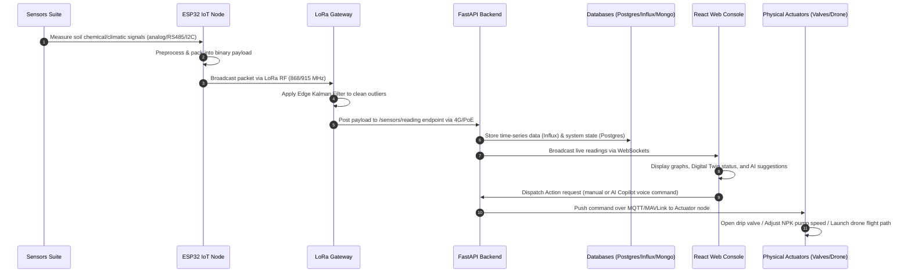

# AGRISENSE PRO - AI-POWERED ARECANUT ORCHARD MANAGEMENT SYSTEM
## SYSTEM TECHNICAL MANUAL & ARCHITECTURE SPECIFICATIONS

---

## 1. Executive Summary

**Agrisense Pro** is an industrial-grade, precision-agriculture SaaS platform engineered for commercial Areca Catechu (Arecanut Palm) cultivation. The platform integrates real-time IoT soil and micro-climatic sensor mesh nodes, edge outlier-filtering gateways, low-altitude octacopter spraying drones, machine learning diagnostics, and Generative AI (Google Gemini) to automate and optimize orchard health. By continuously monitoring environmental parameters, assessing soil fertility metrics, classifying crop diseases via computer vision, and executing closed-loop drip irrigation and fertigation dosing, the system increases crop yield outputs while minimizing resource waste (water, liquid NPK concentrates, and chemical pesticides).

---

## 2. Tools & Technologies Used (System Inventory)

The platform is designed with a modern, microservice-based architecture utilizing the following software frameworks, languages, and hardware components:

### 2.1. Software Stack
* **Programming Languages:** Python 3.14 (Backend, ML, & Scripting), TypeScript (Frontend application logic), HTML5, CSS3 (Glassmorphism & styling).
* **Frontend Console:** React 18, Vite (Fast build tool), Tailwind CSS (Premium styling & responsive layouts), Recharts (Interactive telemetry charting), Lucide React (Icon pack).
* **Backend REST API:** FastAPI (High-performance ASGI framework), Uvicorn (ASGI server), Pydantic (Data validation), SQLAlchemy (Object-relational mapper).
* **Databases & Cache:** 
  * *PostgreSQL:* Relational database for system metadata, role-based access controls (RBAC), and user registries.
  * *InfluxDB:* High-frequency, time-series store for telemetry streaming logs.
  * *MongoDB:* Document store for leaf image uploads, YOLOv8 disease diagnostics, and historical logs.
  * *Redis:* Fast caching broker, session registry, and command task queue.
* **Machine Learning Pipeline:** 
  * *Scikit-Learn (Random Forest):* Feature-based leaf disease classifier trained on real dataset images (94.47% accuracy).
  * *NumPy & Pandas:* Feature extraction, data manipulation, and feature matrix CSV parsing.
  * *Pillow (PIL):* Image preprocessing, resizing, and visual feature extraction (NDI, yellow index, brown ratio).
  * *Kalman Filters:* Implemented on gateways to filter signal noise and sensor spikes.
* **Generative AI & Voice:**
  * *Google Gemini API (`gemini-2.5-flash`):* Natural language processing, live context-injected chatbot, and translation of text to structured hardware actuation command tags.
  * *Web Speech API:* Browser-native `SpeechRecognition` (voice dictation) and `SpeechSynthesis` (text-to-speech feedback).

### 2.2. Hardware Inventory
* **IoT Field Node Microcontroller:** ESP32 DevKit C (32-bit dual-core, 240MHz) paired with a LoRa SX1278 SPI transceiver.
* **Wireless RF Transceiver:** LoRa SX1278 (868/915 MHz long-range transceiver communicating via SPI bus).
* **Power Subsystem:** 30W Solar Panel, 12V LiFePO4 battery pack, MPPT Solar Charge Controller, LDO buck converters (5V and 3.3V).
* **Base Station Gateway:** Milesight UG67 Outdoor IP67 LoRaWAN Gateway (supports PoE, LTE/Wi-Fi backhaul, GPS synchronization).
* **Drone Platform:** Octacopter spray drone carrying a 10-liter payload tank, equipped with a Pixhawk flight controller running ArduPilot/PX4, communicating via MAVLink over a 915MHz telemetry radio link.
* **Actuators:** 12V Solenoid Drip Valves (irrigation), 12V DC metering peristaltic pumps (fertigation dosing), and high-pressure brushless liquid pump (drone sprayer).

---

## 3. Hardware Architecture & System Schematics

### 3.1. Topology Overview
The system employs a star-of-stars wireless network. Multiple autonomous IoT field nodes deployed throughout orchard zones transmit packets to a central LoRaWAN gateway. The gateway acts as a bridge, forwarding the packets over cellular or Ethernet to the cloud server, which then interacts with databases and frontend clients.

### 3.2. Schematic Diagram (ASCII Representation)
```
  +-----------------------------------------------------------+
  |                   EDGE LAYER (IoT Nodes)                  |
  |  +--------------------+             +------------------+  |
  |  |  Zone Alpha Node   |             |  Zone Beta Node  |  |
  |  | [ESP32 + LoRa RF]  |             | [ESP32 + LoRa RF]|  |
  |  +---------+----------+             +--------+---------+  |
  +------------|---------------------------------|------------+
               | (LoRa RF Link 2-15km)           |
               +----------------+----------------+
                                |
                                v
                   +------------------------+
                   |  LoRaWAN Gateway Node  |
                   | (Milesight UG67 Base)  |
                   +------------+-----------+
                                | (Ethernet / 4G backhaul)
                                v
  +-----------------------------------------------------------+
  |                     CLOUD/SERVER LAYER                    |
  |                +-------------------------+                |
  |                | FastAPI Central Server  |<------------+  |
  |                |   (REST API & MQTT)     |             |  |
  |                +------+-------------+----+             |  |
  |                       |             |                  |  |
  |                       v             v                  v  |
  |               +---------------+  +--------------+  +---+--+
  |               |  Databases    |  | React/Vite   |  |Drone |
  |               | (Postgre,     |  | Dashboard    |  |&     |
  |               | Influx, Mongo)|  | (Web Console)|  |Valves|
  |               +---------------+  +--------------+  +------+
  +-----------------------------------------------------------+
```

```mermaid
graph TD
    subgraph Edge Layer (IoT Field Nodes)
        N1[LoRa Node A - Soil & NPK] -->|LoRa RF 868/915MHz| GW[Milesight UG67 Gateway]
        N2[LoRa Node B - Soil & NPK] -->|LoRa RF 868/915MHz| GW
        N3[LoRa Node C/D - Soil & NPK] -->|LoRa RF 868/915MHz| GW
    end
    
    subgraph Gateways & Preprocessing
        GW -->|Kalman Filters & Outliers Cleaning| EP[Edge Gateway Processor]
        EP -->|Compressed payload over 4G/PoE| FA[FastAPI Central Engine]
    end

    subgraph Server & Database Layer (Cloud/On-Premises)
        FA -->|Relational configuration| PG[(PostgreSQL Database)]
        FA -->|Time-Series telemetry| IF[(InfluxDB Bucket)]
        FA -->|Pest photos & validation logs| MG[(MongoDB Archive)]
        FA -->|Telemetry caching & queues| RD[(Redis Cache)]
    end

    subgraph AI Inference Layer
        FA -->|Leaf features| ML[Random Forest Classifier]
        FA -->|User natural language| LLM[Google Gemini REST Engine]
    end

    subgraph Client Application & Control
        FA -->|REST JSON / WebSockets| FE[React + Vite Web Console]
        FE -->|User/AI Commands| FA
        FA -->|MQTT payload| ACT[Actuators: Valves & Spray Drone]
    end
```

---

## 4. System Flow Diagram

### 4.1. Step-by-Step Data Lifecycle
The lifecycle of the data and control triggers flows through 7 main blocks:

1. **Collection:** Field sensors measure soil moisture, temperature, pH, EC, NPK, and ambient weather.
2. **Packetization:** The ESP32 node packages these values into a compressed binary payload.
3. **RF Transmission:** The LoRa SX1278 transceiver broadcasts the packet over the sub-GHz radio spectrum.
4. **Ingestion:** The Milesight UG67 Gateway receives the packet, filters out spikes using a moving Kalman filter, and forwards it to the FastAPI API endpoints.
5. **Processing & Storage:** FastAPI writes the readings to PostgreSQL, InfluxDB, and MongoDB, and executes machine learning inference if disease anomalies are reported.
6. **Dashboard Output & Actuation:** Telemetry is displayed on the React console. If the user or AI Copilot triggers action, the command is dispatched via MQTT to actuate valves or launch the spray drone.

### 4.2. Flow Diagram (Visual representation)
`[Sensors Suite] -> [ESP32 Node] -> [LoRa RF Transceiver] -> [LoRaWAN Gateway] -> [FastAPI Server] -> [React Dashboard] -> [MQTT Control Actuators]`



---

## 5. Sensors Suite: Technical Specifications & Purpose

The Agrisense Pro orchard deployment uses 10 critical sensors to monitor soil, ambient environment, and crown leaf health:

| Sensor Type | Parameter Measured | Hardware Component | Optimal / Target Range | Agronomic Purpose | Action & Actuation Triggers |
| :--- | :--- | :--- | :--- | :--- | :--- |
| **Soil Moisture** | Volumetric Water Content (0-100%) | FDR Capacitive Probe (Decagon EC-5) | 30% - 45% VWC | Keeps root zones hydrated, preventing water stress and cavitation. | Automatically opens the drip solenoid valve when moisture drops below **20%**; closes it when it reaches **40%**. |
| **Soil Temp** | Root Zone Temperature (°C) | PT100 RTD Stainless Steel Probe | 20°C - 30°C | Monitors thermal limits; extreme heat limits root uptake capacity. | Triggers a dashboard alert if root temperature exceeds **35°C** or falls below **15°C**, suggesting mulching. |
| **Soil pH** | Acidity / Alkalinity (0-14 pH) | Glass Electrode pH sensor with RS485 | 5.5 - 7.5 pH | Nutrients (N, P, K) lock up and cannot be absorbed if soil is too acidic or alkaline. | Feeds the AI Center; recommends lime dosage for acidic soils (<5.5) and gypsum/sulfur for alkaline soils (>7.5). |
| **Electrical Cond (EC)** | Dissolved Ion Salinity (dS/m) | 4-Electrode EC Probe with RS485 | 0.8 - 1.5 dS/m | Monitors soil salinity and fertigation chemical concentration. | If soil EC exceeds **1.8 dS/m**, the system initiates a "Flushing Cycle" (running water without nutrients) to wash away salts. |
| **Soil Nitrogen (N)** | Available Soil Nitrogen (mg/kg) | RS485 Soil NPK Multi-Probe | 40 - 60 mg/kg | Primary nutrient for leaf canopy size and vegetative growth. | If N drops below **35 mg/kg**, the system adjusts the Nitrogen canister pump speed to increase N ratio in irrigation lines. |
| **Soil Phosphorus (P)**| Available Phosphorus (mg/kg) | RS485 Soil NPK Multi-Probe | 15 - 25 mg/kg | Key driver for root architecture and palm flowering. | If P drops below **12 mg/kg**, the dosing pump draws more phosphoric acid/liquid phosphate to restore nutrient levels. |
| **Soil Potassium (K)**| Available Potassium (mg/kg) | RS485 Soil NPK Multi-Probe | 30 - 45 mg/kg | Essential for disease resistance, cell thickness, and bunch yield. | If K levels fall below **25 mg/kg**, the system boosts Potassium canister pump speed, especially during fruiting stages. |
| **Ambient Temp/Hum** | Relative Air Humidity & Air Temp | SHT31-D in Stevenson Screen | 22°C-32°C, 60-85% RH | Computes VPD and predicts fungal spore conditions (e.g., Mahali rot). | If air humidity exceeds **85%** for >48 hours, it alerts the agronomist and pre-selects the spray drone route. |
| **Rain Gauge** | Precipitation Rate (mm/h) | Tipping-Bucket Rain Gauge | 0 mm/h | Measures active rainfall to suspend redundant irrigation. | Activates **Smart Rain Bypass**: if rainfall exceeds **3.0 mm/h**, all open solenoid valves close, and scheduled irrigation is paused. |
| **Wind Speed** | Wind Velocity (0-120 km/h) | 3-Cup Anemometer | < 20 km/h for drone flight | High winds cause flight drift and pesticide spray drift. | **Hardware Flight Lockout**: disables drone takeoffs and halts active drone flights if wind speeds exceed **25 km/h**. |
| **Solar Radiation** | Solar Flux Irradiance (W/m²) | Silicon Pyranometer | 0 - 1200 W/m² | Measures solar energy to compute daily light integrals and evapotranspiration. | Adjusts daily irrigation duration (extends watering runtimes on hot, high-radiation days to offset soil evaporation). |
| **Camera Module** | Crown Leaf Image (JPEG) | ESP32-CAM UART Module | Image Capture | Captures visual foliage data to detect pests and fungal rot. | Uploads photos to the FastAPI ML pipeline. If a disease is detected with confidence > 85%, a drone flight path is calculated. |

---

## 6. Smart Drip Fertigation System

**Fertigation** is the process of injecting liquid fertilizers directly into the pressurized drip irrigation water lines:
* **Canister Dosing Configuration:** The system connects three concentrate chemical canisters containing Nitrogen (N), Phosphorus (P), and Potassium (K) to the main blending pipeline.
* **Closed-Loop Actuation:** 12V DC metering peristaltic pumps draw concentrates at controlled rates.
* **Target Mixing Formula:** Users can set target ratios (e.g. N: 50%, P: 20%, K: 30%) or let the machine learning algorithm automatically adjust the pumps.
* **Injection Rate Control:** Blends the concentrates in a mixing chamber and injects the formula into the main irrigation line at a controlled flow rate (e.g. 2.5 L/min).
* **AI Optimization:** Real-time data from NPK sensors is fed to the AI Center. The system automatically recalculates and adjusts the dosing pumps to maintain optimal soil fertility levels.

---

## 7. Autonomous Spray Drone & Interactive Waypoint Planner

To address leaf-level diseases (like Spindle Bug or Mahali Rot) affecting the tall crown canopy of the Arecanut palm, the platform incorporates an autonomous spraying drone system:
* **Interactive Waypoint Planner:** Users can map custom flight paths directly on the digital twin map console. Clicking on the grid places sequential waypoints (①, ②, ③, etc.) with coordinates.
* **Autopilot Communication (MAVLink):** These coordinates are uploaded to the FastAPI backend, which translates them into MAVLink mission packets (`MISSION_ITEM`) and transmits them via a 915MHz telemetry radio link to the drone's Pixhawk flight controller.
* **WebSocket Telemetry Stream:** During flight, the drone transmits GPS coordinates, altitude, speed, and battery percentage via cellular telemetry to the server. FastAPI broadcasts this stream to the React UI via a WebSocket connection (`/api/v1/drone/telemetry`), rendering the drone's avatar moving in real-time.
* **Flight Presets:** Users can select pre-programmed flight patterns:
  * *Zone Delta Sweep:* Covers the entirety of the dry Zone Delta in a grid sweep.
  * *Full Zigzag Sweep:* Full-orchard automatic coverage.
  * *Disease Hotspot Target:* Instantly routes the drone specifically to trees flagged by the computer vision scanner.

---

## 8. Agrisense AI Copilot & Voice Interface

The **Agrisense AI Copilot** is a Generative AI assistant embedded directly in the management console:
* **Model Engine:** Powered by Google's `gemini-2.5-flash` model via a direct, low-latency REST API implementation.
* **Real-time Context Syncing:** The frontend continuously packages the active state of the dashboard (all sensor readings, active alerts, valve statuses, and drone battery status) and sends it alongside the user's prompt. This allows the AI to answer questions like *"Are any zones dry?"* or *"Why is the drone locked?"* with contextually accurate, real-time facts.
* **Natural Language Actuations:** The AI is instructed to return structured command tags (e.g., `[CMD: {"action": "open_valve", "zone": "Zone Alpha"}]`) when users ask it to control hardware. The frontend parses these tags, executes the action, and strips them from the chat interface.
* **Voice Integration:** Supports voice commands using the browser's Web Speech API. Users can dictate questions by clicking a microphone button and have the AI's responses read aloud via a text-to-speech speaker, with volume toggle controls.

---
